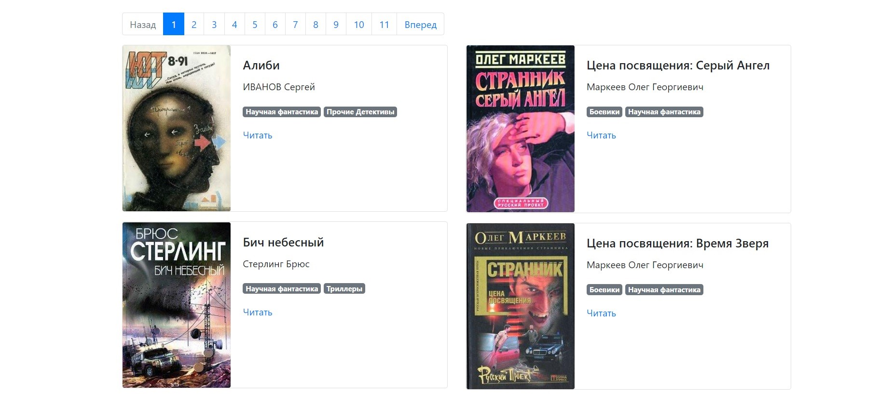

# Book parser from tululu.org

## Description

The script print data about the selected books.

In parameters, you need to specify from which id and to which id to parse books.

## How to install?

Python3 should be already installed. 
Then use `pip` (or `pip3`, if there is a conflict with Python2) to install dependencies:

```commandline
pip install -r requirements.txt
```

Recommended to use [virtualenv/venv](https://docs.python.org/3/library/venv.html) for isolate the project

## Launch.
### parse_tululu.py

This script downloads books with absolutely any category, selecting id-books. This script has two arguments that you can use when running:
```commandline
id_from - Pass here the id of the book you want to start the search
id_to - Pass here the id of the book you want to end the search on
```
Run `parse_tululu.py` with the parameters "id_from", "id_to", to print data about the selected books.
```commandline
python3 parse_tululu.py 5 10
```

### parse_tululu_category.py

This script downloads books from the "Science Fiction" category. This script has several arguments that you can use when running:

```commandline
start_page - Specify which page to start parsing from | DEFAULT=1
last_page - Specify on which page to end parsing | DEFAULT=None
dest_folder - Folder where the parsing result will be saved | DEFAULT='./'
skip_imgs - Specify this flag if you don't want to download photo books | DEFAULT=False
skip_txt - Specify this flag if you don't want to download book text | DEFAULT=False
json_path - You can specify your path to the .json file where the information about the books will be.| DEFAULT='./'
```
If no arguments are specified, the script will take the default values.

To start the script, write in the console:
```commandline
python3 parse_tululu_category.py
```

Example of script with parameters:
```commandline
python parse_tululu_category.py --start_page 700
python parse_tululu_category.py --start_page 500 --last_page 505

```

### render_website.py 

This script will create site pages from a `template.html` and  `books.json` file.
Then it runs the site on the local machine.

To start the script, write in the console:
```commandline
python3 render_website.py
```
An example of site work can be seen at the link [lib_parser](https://vnetraffiqua.github.io/lib_parser/pages/index1.html).



=========================================================

The code is written for educational purposes on online-course for web-developers [dvmn.org](https://dvmn.org).